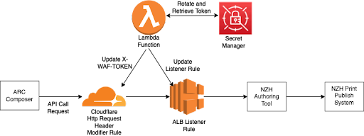

# Rotation of AWS Secrets
## Project Description
The NZH Authoring tool application supplements the Composer with a set of additional authoring helper tools. This application includes APIs that can be called via the Arc Composer to send stories to NZH print publishing systems. The security of these API calls is critical to prevent any unsolicited access to the NZ Herald print publishing system. For this purpose, it is important to ensure that requests to the NZH Authoring tool go through Cloudflare before propagating to the Application Load Balancer (ALB) in AWS. When the API call reaches Cloudflare, a secret TOKEN header is added to the request. This token is then verified at the ALB before it reaches the NZH Authoring tool application.


The lambda function rotates this secret token in AWS Secret Manager periodically and updates them in the Cloudflare Header modification rule and the Application Load Balancer Listener Rule. Periodic rotation of tokens prevents them from being hardcoded and prevents any unsolicited access to the print publishing system.



## Instructions

### Amazon ECR Set Up
1. Create a new ECR repository with a concise name and private visibility setting.
2. Use the push commands available on the top right corner of the repository to:
    1. Retrieve an authentication token and authenticate your Docker client to your registry. This step will require assuming a role to gt access to the NZH AWS account. Multifactor Authentication is also enabled.
    2. Build your Docker image.
    3. Tag the image.
    4. Push the image to the newly created AWS repository.
3. Refresh the page to see the newly pushed image tagged as "latest" in the repository
### How to assume a role when multifactor acuthentication is enabled
1. Configure AWS CLI using the command 
```
AWS configure
```
2. Use an authenticator application to generate a token code. Example:"123456". Use the key to get a temporary session from the security token service(STS). 
```
aws sts get-session-token --serial-number arn:aws:iam::770597244556:mfa/IAM-user-name  --token-code 110213
```
The values from the output, such as the access key ID, secret access key and session token need to be saved in the ~/.aws/config under a new profile.
```
[mfa]
aws_access_key_id = temp_accessKey_id
aws_secret_access_key = temp_secret_access_key
aws_session_token =temp_session_token

```
3. Using the new profile assume the *nzh-developer* role using the command:
```
aws sts assume-role --role-arn "arn of the iam role" --role-session-name AWSCLI-Session --profile mfa
```
The values from the output need to be saved in the ~/.aws/config under a new profile.
```
[session]
aws_access_key_id = temp_accessKey_id
aws_secret_access_key = temp_secret_access_key
aws_session_token =temp_session_token
```
4. Using the new profile get access to the AWS services under the assumed role. Example, to get access to the ECR use the command:
```
aws ecr get-login-password --profile session --region ap-southeast-2 | docker login --username AWS --password-stdin 32151245.dkr.ecr.ap-southeast-2.amazonaws.com
```


### AWS Lambda Set Up
1. Create a new function using the following settings:
    1. Choose the container image radio button
    2. Browse the container image that was pushed to ECR and click the create function button.
    3. Under configuration tab, go to permissions and add a permission with 'Lambda:InvokeFunction" action.
    4. Add a policy that allows rottion of secret to the Lambda Function execution role. The policy can be found in the [AWS Documentation](https://docs.aws.amazon.com/secretsmanager/latest/userguide/rotating-secrets-required-permissions-function.html)
    5. Add a policy to allow the modify rule function in ELBv2 service.
    6. Add a policy to allow GetSecretValue of Cloudflare API key stored in the secret manager.
    7. Under the General Configuratio, edit the Timeout time to 10 seconds.

### Application Load Balancer Set Up
1. Create Application Load Balancer with the following settings:
    1. Scheme: interenet-facing
    2. IP address type: IPv4
    3. VPC: Select the default one
    4. Subnet: Choose both ap-southeast-2a and ap-southeast-2b
    5. Security Group: Choose Default
    6. Listener and Routing: Add the port number, create a target group of type 'Instance' and click on 'Create Load Balancer'

### Listener Set Up
1. Add a Listener for the load balancer to forward the traffic to the target group.
2. Add the default Security Policy and add the SSL/TLS Certificate of the target website. If the certificate is not available, click on 'Request new ACM Certificate' and add the new certificate. Click on Add to Create a new listener.
3. Under the rules tab in the listener, add a rule for Htttp Header: X-SECRET to have a randome value (this value will be rotated by the lamnbda function).


### AWS Secrets Manager Set Up
1. Create a new secret in the secrets manager using the following settings.
    1. Secret Type: "Other type of secret
    2. Store secret in plain text rather than the key/value pair
    3. Encryption Key: aws/secretsmanager
    4. Enable Rotation and add the lambda function created.
2. Create another secret to store the Cloudflare API key which will be used to access to Cloudflare.

### Cloudflare Set Up
1. Add a website 
2. Under the 'API Token' tab, create a custom token.
3. Add the permissions: 'Zone', 'Transform Rules', 'Edit'
4. Include all zones and create the API token.
5. Copy the Authorization Bearer key and store it in the Secrets Manager. This key cannot be retrieved again unless a new key is generated by rolling the token.
6. Create a Transform Rule to Modify The Request Header with the following settings: 
    1.  If incoming requests match *http.host ne "1"*, then modify the request header to add a static Header name *X-SECRET* with a random value (this value will be rotated by the lambda function).

### Build the Docker Image
Use the following command in the ```cloudflare-alb-token-refresh``` directory: 

  ```
  docker build -t nzh-cf-token-rotation-lambda . 
  ```

### Run Unit Tests
To run unit tests execute the following commands from the cloudflare-alb-token-refresh directory:

```
python -m unittest discover -s tests
```
To run each test individually use the following commands:

```
python -m unittest discover tests "test_cloudflare_helper.py"
python -m unittest discover tests "test_loadbalancer_helper.py"
python -m unittest discover tests "test_lambda_function.py"
```
## References

1. The Secret Manager Rotation Lambda Function template taken from [Github](https://github.com/aws-samples/aws-secrets-manager-rotation-lambdas/blob/master/SecretsManagerRotationTemplate/lambda_function.py).

2. Policy that allows rotation of secret from [AWS documentation](https://docs.aws.amazon.com/secretsmanager/latest/userguide/rotating-secrets-required-permissions-function.html)

3. API to update a rule in the cloudflare rulset [Cloudflare API](https://developers.cloudflare.com/ruleset-engine/rulesets-api/update-rule/).

4. Using AWS SDK for Python (Boto3) to configure and manage the AWS services.API to modify listener rule of the [Application Load Balancer](https://boto3.amazonaws.com/v1/documentation/api/latest/reference/services/elbv2.html#ElasticLoadBalancingv2.Client.modify_rule).
# cloudflare-token-refresh
